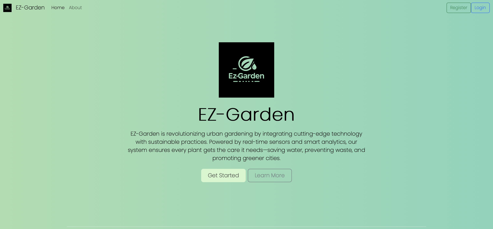
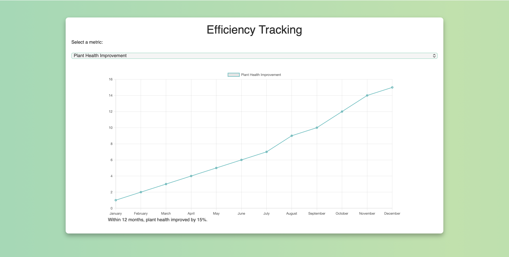

🌿 EZ-Garden 🌿

A next‑generation smart garden management system built with Flask, Firebase Firestore, and a modern web UI.EZ‑Garden empowers municipalities, companies, and private gardeners with real‑time insights, visual dashboards, automated maintenance tools, and interactive maps.

⸻

📌 About This Project
EZ‑Garden combines technology + sustainability to create a powerful yet simple platform for managing plants, areas, employees, maintenance tasks, and educational content.Designed for both urban environments and large garden operations, the system helps you:

Monitor plant health

Improve water efficiency

Track issues and maintenance

Analyze performance with graphs & dashboards

Navigate interactive city maps

Provide educational experiences for kids

⸻

🌿 Overview

EZ‑Garden is a complete management platform for gardens, farms, municipalities, and green companies. It allows administrators and employees to track plant data, manage areas, record issues, analyze efficiency, and access visual dashboards.

⸻

🚀 Features
	•	🔐 Login system (employees + private users)
	•	🌱 Plant database and plant detail pages
	•	📊 Efficiency dashboard (graphs, charts, metrics)
	•	🧪 Water-saving recommendations
	•	🗺️ Map + areas overview
	•	🛠️ Issues reporting & maintenance module
	•	👨‍🏫 Educational content for kids
	•	🗃️ Firestore database integration
	•	📂 File uploads + images

⸻

📸 Screenshots

🗺️ Interactive City Map


🏙️ System Landing Page




🔐 Registration Selection


📊 Efficiency Tracking Dashboard


⸻

## 🏗️ Project Structure

```plaintext
EZ-Garden/
├── app.py
├── requirements.txt
├── firebase-key.json        
├── .gitignore
│
├── templates/
│   ├── *.html
│
├── static/
│   ├── css/
│   ├── js/
│   ├── images/
│
├── photos/                  # screenshots used in README
│   ├── home1.png
│   ├── home2.png
│   ├── map.png
│   ├── dash.png
│   ├── register.png
│
└── __pycache__/
```
⸻

🏃 Running the Project

1. Create venv (Python 3.11 only!)

python3.11 -m venv venv
source venv/bin/activate

2. Install dependencies

pip install -r requirements.txt

3. Run

python3.11 app.py


⸻

🧩 Future Improvements
	•	Add mobile version
	•	Add admin analytics
	•	Improve caching & performance
	•	Add image recognition for plants

⸻

👤 Author

Inon Kadosh

⸻

(נוסיף כאן תיאור מלא, תמונות ומבנה הפרויקט אחרי שתשלח לי את קובץ ה-credentials החדש או כל תמונה שתרצה להכניס.)
